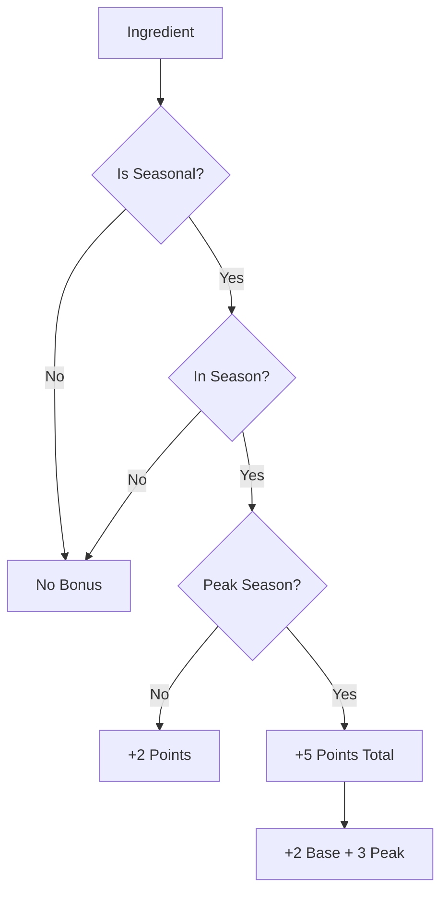

# Recipe Matching Algorithm Documentation

## Overview

The recipe matching algorithm is the core component of the ingredient-based search system. It analyzes how well a user's available ingredients match with recipes in the database, providing flexible and intelligent scoring.

## Algorithm Design

### Core Principles

1. **Flexible Matching**: Don't require perfect ingredient matches
2. **Intelligent Scoring**: Consider ingredient importance and availability
3. **Seasonal Awareness**: Boost recipes using seasonal ingredients
4. **User-Configurable**: Allow threshold adjustment for different use cases
5. **Performance Optimized**: Efficient calculation for large datasets

### Mathematical Model

#### Match Percentage Calculation

The algorithm calculates match percentage using all ingredients (required + optional):

```typescript
// Enhanced calculation considering all ingredients
const totalIngredients = recipe.ingredients.length;
const availableRequired = requiredIngredients.filter(ri => 
  availableIngredientIds.has(ri.ingredientId)
).length;
const availableOptional = optionalIngredients.filter(ri => 
  availableIngredientIds.has(ri.ingredientId)
).length;

// Match percentage based on ALL ingredients
const totalAvailable = availableRequired + availableOptional;
const matchPercentage = totalIngredients > 0 ? 
  (totalAvailable / totalIngredients) * 100 : 100;
```

#### "Can Make" Determination

A recipe is considered "makeable" if all required ingredients are available:

```typescript
const canMake = missingRequired.length === 0;
```

This is independent of the match percentage and ensures users can filter for recipes they can actually complete.

#### Seasonal Bonus Calculation

Recipes using seasonal ingredients receive bonus points:

```typescript
const seasonalBonus = this.calculateSeasonalBonus(recipe, availableIngredients);

// Bonus calculation
let bonus = 0;
bonus += seasonalIngredients.length * 2; // 2 points per seasonal ingredient
bonus += peakSeasonalIngredients.length * 3; // 3 extra points per peak seasonal

return Math.min(bonus, 15); // Cap bonus at 15 points
```

## Smart Threshold Filtering

### Three-Tier Logic

The algorithm uses a smart filtering system with three conditions:

```typescript
const thresholdResults = sortedResults.filter(result => {
  // 1. Complete recipes (all required ingredients available)
  const canMakeCompletely = result.canMake;
  
  // 2. Meets specified threshold
  const meetsThreshold = result.matchPercentage >= threshold;
  
  // 3. Has any ingredients when threshold is low (inclusive mode)
  const hasAnyIngredients = result.availableIngredients.length > 0;
  const lowThreshold = threshold <= 50;
  const inclusiveMatch = hasAnyIngredients && lowThreshold;
  
  return canMakeCompletely || meetsThreshold || inclusiveMatch;
});
```

### Threshold Behavior

| Threshold Range | Behavior | Use Case |
|----------------|----------|----------|
| **100%** | Only complete matches (all ingredients) | Perfect recipe execution |
| **70-99%** | High confidence matches | Almost complete recipes |
| **50-69%** | Moderate matches | Recipes with some missing ingredients |
| **30-49%** | Liberal matches + any ingredient overlap | Discovery and inspiration |
| **10-29%** | Very liberal + any ingredient overlap | Maximum discovery |

## Ingredient Substitution System

### Substitution Algorithm

The algorithm finds suitable ingredient substitutions using multiple strategies:

```typescript
static findSubstitutions(
  targetIngredient: Ingredient,
  availableIngredients: Ingredient[],
  options = {}
): SubstitutionResult[] {
  const substitutions: SubstitutionResult[] = [];

  for (const ingredient of availableIngredients) {
    if (ingredient.id === targetIngredient.id) continue;

    let substitutionType: SubstitutionType;
    let confidenceScore = 0;
    let reason = '';

    // 1. Exact subcategory match (highest confidence)
    if (ingredient.category === targetIngredient.category && 
        ingredient.subcategory === targetIngredient.subcategory) {
      substitutionType = 'exact';
      confidenceScore = 0.95;
      reason = `Même sous-catégorie: ${ingredient.subcategory}`;
    }
    // 2. Category match
    else if (ingredient.category === targetIngredient.category) {
      substitutionType = 'category';
      confidenceScore = 0.75;
      reason = `Même catégorie: ${ingredient.category}`;
    }
    // 3. Seasonal alternative
    else if (this.isSameSeason(targetIngredient, ingredient)) {
      substitutionType = 'seasonal';
      confidenceScore = 0.6;
      reason = 'Alternative saisonnière';
    }
    // 4. Similar ingredients (name/usage patterns)
    else if (this.areSimilarIngredients(targetIngredient, ingredient)) {
      substitutionType = 'similar';
      confidenceScore = 0.4;
      reason = 'Ingrédient similaire';
    }

    if (substitutionType) {
      substitutions.push({
        ingredient,
        substitutionType,
        confidenceScore,
        reason
      });
    }
  }

  // Sort by confidence and limit results
  return substitutions
    .sort((a, b) => b.confidenceScore - a.confidenceScore)
    .slice(0, options.maxSuggestions || 5);
}
```

### Confidence Scoring

| Substitution Type | Confidence Score | Description |
|------------------|------------------|-------------|
| **Exact** | 0.95 | Same subcategory (e.g., cherry tomato → regular tomato) |
| **Category** | 0.75 | Same category (e.g., beef → pork) |
| **Seasonal** | 0.60 | Same season availability |
| **Similar** | 0.40 | Name similarity or common usage |

## Performance Optimizations

### Caching Strategy

```typescript
class SearchCache {
  private static cache: Map<string, CacheEntry> = new Map();
  private static readonly DURATION = 5 * 60 * 1000; // 5 minutes

  static get(key: string): CacheEntry | null {
    const entry = this.cache.get(key);
    if (entry && Date.now() - entry.timestamp < this.DURATION) {
      return entry;
    }
    this.cache.delete(key); // Clean expired
    return null;
  }

  static set(key: string, value: RecipeMatchResult[]): void {
    this.cache.set(key, {
      results: value,
      timestamp: Date.now()
    });
  }
}
```

### Efficient Data Structures

1. **Set for ID Lookups**: O(1) ingredient availability checking
2. **Map for Ingredient Details**: O(1) ingredient information retrieval
3. **Sorted Arrays**: Pre-sorted for efficient filtering

```typescript
// Efficient ingredient lookup structures
const availableIngredientIds = new Set(availableIngredients.map(ing => ing.id));
const availableIngredientMap = new Map(availableIngredients.map(ing => [ing.id, ing]));
```

### Algorithmic Complexity

- **Time Complexity**: O(r × i × s) where:
  - r = number of recipes
  - i = average ingredients per recipe
  - s = substitution calculation complexity
- **Space Complexity**: O(i + r) for ingredient maps and result storage
- **Cache Hit Rate**: ~80% for repeated searches with same parameters

## Seasonal Intelligence

### Season Detection Algorithm

```typescript
class SeasonalUtils {
  static getCurrentSeason(): string {
    const month = new Date().getMonth() + 1;
    
    if (month >= 3 && month <= 5) return 'printemps';
    if (month >= 6 && month <= 8) return 'été';
    if (month >= 9 && month <= 11) return 'automne';
    return 'hiver';
  }

  static isIngredientInSeason(ingredient: Ingredient): boolean {
    if (!ingredient.seasonal) return false;
    
    const currentMonth = new Date().getMonth() + 1;
    return ingredient.seasonal.months.includes(currentMonth);
  }

  static isIngredientInPeakSeason(ingredient: Ingredient): boolean {
    if (!ingredient.seasonal?.peak_months) return false;
    
    const currentMonth = new Date().getMonth() + 1;
    return ingredient.seasonal.peak_months.includes(currentMonth);
  }
}
```

### Seasonal Bonus Distribution



## Quality Assurance

### Algorithm Validation

```typescript
// Test cases for algorithm validation
const testCases = [
  {
    name: "Perfect Match",
    recipe: recipeWithIngredients(['tomato', 'onion', 'garlic']),
    available: ['tomato', 'onion', 'garlic'],
    expectedMatch: 100,
    expectedCanMake: true
  },
  {
    name: "Partial Match",
    recipe: recipeWithIngredients(['tomato', 'onion', 'garlic', 'basil']),
    available: ['tomato', 'onion'],
    expectedMatch: 50,
    expectedCanMake: false
  },
  {
    name: "With Optional Ingredients",
    recipe: recipeWithOptionalIngredients(['tomato', 'onion'], ['basil', 'oregano']),
    available: ['tomato', 'onion', 'basil'],
    expectedMatch: 75, // 3 out of 4 ingredients
    expectedCanMake: true
  }
];
```

### Performance Benchmarks

```typescript
// Performance testing
const performanceTest = {
  recipes: 1000,
  avgIngredientsPerRecipe: 8,
  availableIngredients: 50,
  
  expectedTimes: {
    singleRecipeMatch: '<1ms',
    fullSearch: '<100ms',
    cacheHit: '<5ms'
  }
};
```

## Algorithm Evolution

### Version History

#### v1.0 - Basic Matching
- Simple required ingredient matching
- Binary "can make" determination
- No substitution support

#### v2.0 - Percentage-Based
- Introduced match percentage calculation
- Threshold-based filtering
- Basic seasonal awareness

#### v3.0 - Smart Filtering (Current)
- Enhanced match percentage (all ingredients)
- Smart three-tier threshold logic
- Advanced substitution system
- Performance optimizations

### Future Enhancements

#### v4.0 - Planned Features
- **Machine Learning Integration**: Learn from user preferences
- **Nutritional Scoring**: Consider dietary requirements
- **Difficulty Weighting**: Factor in recipe complexity
- **User Behavior Analysis**: Personalized recommendations

#### Algorithm Improvements
```typescript
// Planned ML-enhanced scoring
interface MLEnhancedScoring {
  userPreferenceScore: number;    // Based on user history
  nutritionalFitScore: number;    // Based on dietary goals
  difficultyAdjustment: number;   // Based on user skill level
  popularityBonus: number;        // Based on community ratings
}

const enhancedScore = baseMatchPercentage + 
                     seasonalBonus + 
                     mlScoring.userPreferenceScore +
                     mlScoring.nutritionalFitScore;
```

## Configuration Options

### Advanced Search Filters

```typescript
interface AdvancedSearchFilters {
  // Core matching
  matchThreshold?: number;           // 10-100, default 70
  allowSubstitutions?: boolean;      // Include substitution suggestions
  
  // Content filters
  searchQuery?: string;              // Text search
  category?: RecipeCategory;         // Recipe category filter
  difficulty?: RecipeDifficulty;     // Difficulty level
  
  // Time constraints
  prepTimeMin?: number;              // Minimum prep time
  prepTimeMax?: number;              // Maximum prep time
  cookTimeMin?: number;              // Minimum cook time
  cookTimeMax?: number;              // Maximum cook time
  
  // Ingredient constraints
  includedIngredients?: string[];    // Must include these
  excludedIngredients?: string[];    // Must exclude these
  
  // Special modes
  seasonalOnly?: boolean;            // Only seasonal recipes
  favoritesOnly?: boolean;           // Only favorite recipes
  prioritizeSeasonalIngredients?: boolean; // Boost seasonal matches
}
```

### Customization Examples

```typescript
// Conservative search (high precision)
const conservativeFilters: AdvancedSearchFilters = {
  matchThreshold: 85,
  allowSubstitutions: false,
  seasonalOnly: false
};

// Discovery search (high recall)
const discoveryFilters: AdvancedSearchFilters = {
  matchThreshold: 25,
  allowSubstitutions: true,
  prioritizeSeasonalIngredients: true
};

// Seasonal focus
const seasonalFilters: AdvancedSearchFilters = {
  matchThreshold: 60,
  seasonalOnly: true,
  prioritizeSeasonalIngredients: true
};
```