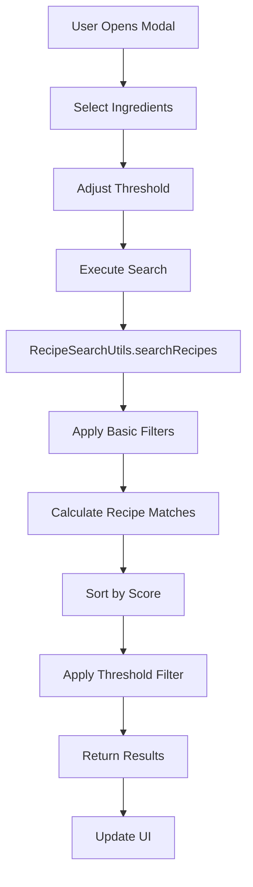

# Ingredient-Based Recipe Search System

## Overview

The ingredient-based recipe search system allows users to find recipes based on ingredients they have available. This system provides flexible matching algorithms that don't require users to have all ingredients for a recipe to be suggested.

## Features

### 🔍 **Smart Recipe Matching**
- **Flexible Algorithm**: Considers both required and optional ingredients
- **Partial Matching**: Shows recipes even when missing some ingredients
- **Intelligent Scoring**: Prioritizes recipes with higher ingredient match percentages
- **Seasonal Boost**: Gives bonus points to recipes using seasonal ingredients

### 🎯 **Configurable Threshold System**
- **Range**: 10% - 100% match threshold
- **Smart Logic**: 
  - 100%: Only recipes you can make completely
  - 70-99%: Recipes you can almost make  
  - 40-69%: Recipes with several missing ingredients
  - 10-39%: Any recipe containing at least one ingredient
- **Default**: 50% for balanced results

### 🌿 **Seasonal Intelligence**
- **Quick Select**: One-click to add all seasonal ingredients
- **Visual Indicators**: Shows which ingredients are in season
- **Peak Season Detection**: Highlights ingredients at peak availability
- **Current Season Display**: Shows season name and available count

### 📱 **User Interface**
- **Search Bar**: Real-time ingredient search with autocomplete
- **Ingredient Selection**: Visual chips showing selected ingredients
- **Clear All**: One-click to reset selection
- **Match Analysis**: Detailed breakdown of recipe matches

## Architecture

### Components

#### `MakeableRecipesModal`
Main modal component for ingredient selection and search configuration.

**Location**: `src/components/recipe/MakeableRecipesModal.tsx`

**Props**:
```typescript
interface MakeableRecipesModalProps {
  visible: boolean;
  onClose: () => void;
  onSearch: (selectedIngredients: string[], matchThreshold: number) => void;
  availableIngredients: Ingredient[];
  initialSelectedIds?: string[];
}
```

**Key Features**:
- Ingredient search and selection
- Seasonal quick-select toggle
- Configurable match threshold slider
- Selected ingredients management
- Search history integration

#### `SeasonalQuickSelect`
Component for seasonal ingredient selection.

**Location**: `src/components/recipe/SeasonalQuickSelect.tsx`

**Features**:
- Current season detection
- Seasonal ingredient filtering
- Peak season indicators
- One-click seasonal selection

#### `IngredientSelector`
Reusable component for ingredient selection with categories.

**Location**: `src/components/recipe/IngredientSelector.tsx`

**Features**:
- Category-based organization
- Collapsible sections
- Seasonal badges
- Multi-select functionality

### Hooks

#### `useWhatCanIMake`
Enhanced hook for ingredient-based recipe matching.

**Location**: `src/hooks/useAdvancedRecipeSearch.ts`

**Methods**:
```typescript
// Find recipes with manually selected ingredients
findRecipesWithSelection(ingredientIds: string[], threshold: number): Promise<void>

// Reset to automatic mode
resetToAutoMode(): Promise<void>

// Get ingredient suggestions
getIngredientSuggestions(currentSelectionIds: string[]): Ingredient[]
```

**State**:
```typescript
{
  makeableRecipes: RecipeMatchResult[];
  loading: boolean;
  error: string | null;
  isManualMode: boolean;
  selectedIngredientIds: string[];
  matchThreshold: number;
}
```

#### `useIngredientSelectionHistory`
Hook for managing ingredient selection history.

**Location**: `src/hooks/useIngredientSelectionHistory.ts`

**Features**:
- Persistent storage with AsyncStorage
- Selection naming and metadata
- Usage frequency tracking
- Quick access to recent selections

### Utilities

#### `RecipeSearchUtils`
Core search and matching algorithms.

**Location**: `src/utils/recipeSearchUtils.ts`

**Key Methods**:

##### `searchRecipes()`
Main search method with flexible filtering.

```typescript
static searchRecipes(
  recipes: Recipe[],
  availableIngredients: Ingredient[],
  filters: AdvancedSearchFilters = {}
): RecipeMatchResult[]
```

**Algorithm**:
1. Apply basic filters (category, difficulty, etc.)
2. Calculate ingredient matches for each recipe
3. Sort by match score and seasonal bonus
4. Apply smart threshold filtering
5. Cache results for performance

##### `calculateRecipeMatch()`
Calculates how well available ingredients match a recipe.

```typescript
static calculateRecipeMatch(
  recipe: Recipe,
  availableIngredients: Ingredient[],
  filters: AdvancedSearchFilters = {}
): RecipeMatchResult
```

**Calculation Logic**:
```typescript
// Match percentage considers ALL ingredients
const totalIngredients = recipe.ingredients.length;
const availableRequired = /* count of available required ingredients */;
const availableOptional = /* count of available optional ingredients */;
const totalAvailable = availableRequired + availableOptional;
const matchPercentage = (totalAvailable / totalIngredients) * 100;

// Can make if no required ingredients are missing
const canMake = missingRequired.length === 0;
```

##### Smart Threshold Filtering
```typescript
const passes = result.canMake || 
              result.matchPercentage >= threshold || 
              (result.availableIngredients.length > 0 && threshold <= 50);
```

## Usage Examples

### Basic Usage

```typescript
// Open ingredient selection modal
const handleOpenModal = () => {
  setMakeableModalVisible(true);
};

// Handle search execution
const handleMakeableSearch = (selectedIngredientIds: string[], threshold: number) => {
  whatCanIMake.findRecipesWithSelection(selectedIngredientIds, threshold);
};

// Render modal
<MakeableRecipesModal
  visible={makeableModalVisible}
  onClose={() => setMakeableModalVisible(false)}
  onSearch={handleMakeableSearch}
  availableIngredients={availableIngredients}
/>
```

### Advanced Configuration

```typescript
// Custom threshold and filters
const customFilters: AdvancedSearchFilters = {
  matchThreshold: 30,
  seasonalOnly: true,
  difficulty: 'facile'
};

const results = RecipeSearchUtils.searchRecipes(
  recipes,
  selectedIngredients,
  customFilters
);
```

### Seasonal Quick Select

```typescript
// Get current seasonal ingredients
const seasonalIngredients = SeasonalUtils.getSeasonalIngredients(availableIngredients);

// Quick select seasonal ingredients
const handleSeasonalSelect = () => {
  const seasonalIds = seasonalIngredients.map(ing => ing.id);
  setSelectedIngredientIds(prev => [...prev, ...seasonalIds]);
};
```

## Performance Optimizations

### Caching
- **Search Results**: Cached for 5 minutes to avoid redundant calculations
- **Ingredient Filtering**: Optimized with Set operations for O(1) lookups
- **Component Memoization**: useMemo and useCallback for expensive operations

### Efficient Algorithms
- **Smart Filtering**: Early exit conditions to reduce unnecessary processing
- **Batch Operations**: Process multiple ingredients efficiently
- **Lazy Loading**: Components render only when needed

## Data Flow



## Error Handling

### Validation
- Input sanitization for all user inputs
- UUID validation for ingredient IDs
- Range validation for threshold values

### Error Recovery
- Graceful fallbacks for failed operations
- User-friendly error messages
- Logging for debugging (development only)

### Security
- No SQL injection vulnerabilities (parameterized queries)
- Input validation at all entry points
- Secure error handling without information leakage

## Testing

### Unit Tests
```typescript
describe('RecipeSearchUtils', () => {
  test('should return recipes with partial matches', () => {
    const result = RecipeSearchUtils.searchRecipes(
      mockRecipes,
      mockIngredients,
      { matchThreshold: 50 }
    );
    expect(result.length).toBeGreaterThan(0);
  });
});
```

### Integration Tests
```typescript
describe('MakeableRecipesModal', () => {
  test('should handle ingredient selection and search', async () => {
    const onSearch = jest.fn();
    render(<MakeableRecipesModal onSearch={onSearch} />);
    
    // Simulate ingredient selection
    fireEvent.press(screen.getByText('Tomate'));
    fireEvent.press(screen.getByText('Trouver des recettes'));
    
    expect(onSearch).toHaveBeenCalledWith(['tomato-id'], 50);
  });
});
```

## Future Enhancements

### Planned Features
- **AI-Powered Suggestions**: Machine learning for better ingredient recommendations
- **Nutritional Analysis**: Show nutritional information for matched recipes
- **Shopping List Integration**: Generate shopping lists for missing ingredients
- **Social Features**: Share ingredient selections and discoveries

### Performance Improvements
- **Elasticsearch Integration**: For large recipe databases
- **Progressive Loading**: Load recipes incrementally
- **Offline Caching**: Store results for offline use

## Troubleshooting

### Common Issues

**No recipes found with low threshold**
- Check if ingredients exist in database
- Verify ingredient IDs are correct
- Ensure recipes have ingredient associations

**Performance issues with large datasets**
- Enable search result caching
- Reduce threshold for broader results
- Consider pagination for very large result sets

**UI responsiveness problems**
- Check for unnecessary re-renders
- Verify component memoization
- Use React DevTools Profiler for analysis